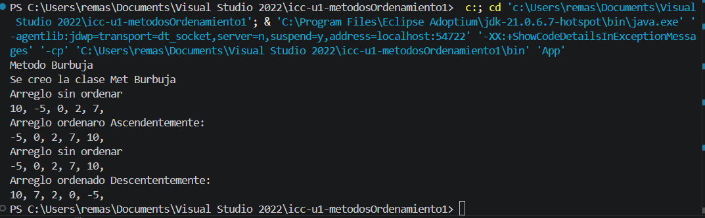

# Práctica: icc-est-u1-metodosOrdenamiento

## Datos del Estudiante
- **Nombre:** Renato Martin Amaya Siguenza
- **Curso:** grupo 3
- **Fecha:** 20/04/2026

---

## 1. Metodos de Ordenamiento-Metodo Burbuja

**Fecha:** 20/04/2026

**Descripción:** Se creó un nuevo proyecto en el cuál se explicó la clase constructor y para que sirve
adicionalmente, se explicó y se creó el metodo burbuja y ordenó un arreglo de numeros ascendente y 
descententemente 

---

## 2. icc-est-u4-complejidad

**Fecha:** 14/03/26
**Descripción:** Cree el poryecto y subimos a GITHUB

---

## 3. icc-est-u4-complejidad

**Fecha:** 15/03/26
**Descripción:** Ejemplos de bucles listados

---

