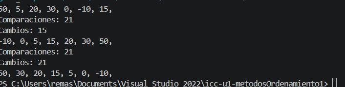
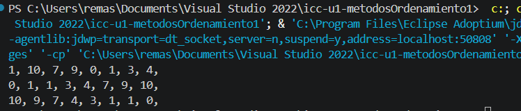

# Universidad Politecnica Salesiana

## Estructura de Datos

## Práctica 1.1 Metodo Burbuja

- **Nombre:** Renato Martin Amaya Siguenza
- **Curso:** grupo 3
- **Fecha:** 20/04/2026

## Evidencia

**Descripción:** Se creó un nuevo proyecto en el cuál se explicó la clase constructor y para que sirve
adicionalmente, se explicó y se creó el metodo burbuja y ordenó un arreglo de numeros ascendente y 
descententemente. 

---

## Práctica 1.2 Metodo Búrbuja Avanzado

- **Nombre:** Renato Martin Amaya Siguenza
- **Curso:** grupo 3
- **Fecha:** 21/04/2026

## Evidencia

**Descripción:** Creamos un nuevo metodo de burbuja mejorado o avanzado, el cual realiza una variacion en las comparaciones de los for y a parte una comparacion extra de un if el cual sirve para poder ordenar de manera ascendente y  descendente en un solo metodo. 

---

## Práctica 1.3 Metodo Selección

- **Nombre:** Renato Martin Amaya Siguenza
- **Curso:** grupo 3
- **Fecha:** 22/04/2026

## Evidencia

**Descripción:** Creamos un metodo llamado de seleccion que busca un indice menor el cual se compara con el resto de elemento de una rreglo, lo presentamos en consola, y despues hicimos el mismo metodo pero de manera descendente.